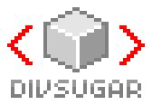

DivSugar - CSS-based 3D Graphics Library
========================================



### DivSugar


```
DivSugar.EPSILON
DivSugar.DEG_TO_RAD
DivSugar.RAD_TO_DEG
```

```
var scene = DivSugar.createScene('sceneId');
var sprite = DivSugar.createSprite('spriteId');
```

### Scene


### Sprite

```
sprite.size();     // returns { w: width, h: height }
sprite.position(); // returns { x: posX, y: posY, z: posX }
sprite.rotation(); // returns { x: rotX, y: rotY, z: rotZ }
sprite.scale();    // returns { x: scaleX, y: scaleY, z: scaleZ }
sprite.visible();
sprite.clip();
sprite.opacity();
sprite.imageClip();
sprite.imageClip(); // returns { u1: , v1: , u2: , v2: }
```

```
sprite.size(w, h);
sprite.position(x, y, z);
sprite.rotation(x, y, z);
sprite.scale(x, y, z);
sprite.visible(visible);
sprite.clip(clip);
sprite.opacity(opacity);
sprite.image(imageUrl);
sprite.image(color);
```

### Vector
